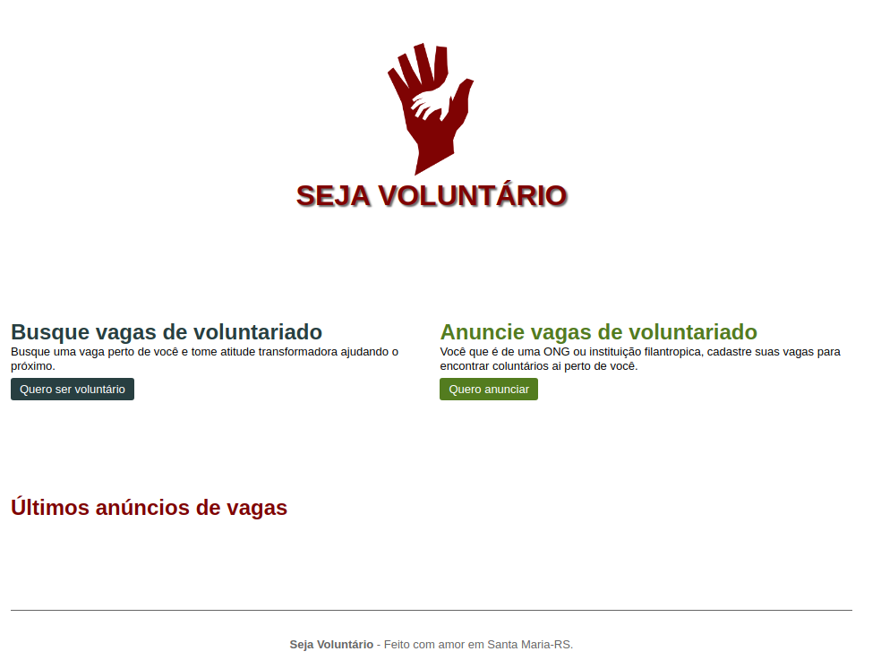

<h1 align="center">
    
</h1>

<h2 align="center">
   
👍 SEJA VOLUNTÁRIO ❤️

</h2>

  
  

  <a href="#rocket-tecnologias">Tecnologias</a>&nbsp;&nbsp;&nbsp;|&nbsp;&nbsp;&nbsp;
  <a href="#computer-projeto">Projeto</a>&nbsp;&nbsp;&nbsp;

 
<h3>Imagens:<h3>

  
  
  

## :rocket: Tecnologias
- [HTML](https://www.w3schools.com/js/js_htmldom_document.asp)
- [CSS](https://devdocs.io/css/)

## :computer: Projeto
> Projeto feito para praticar um pouco de css, html e javascript.
